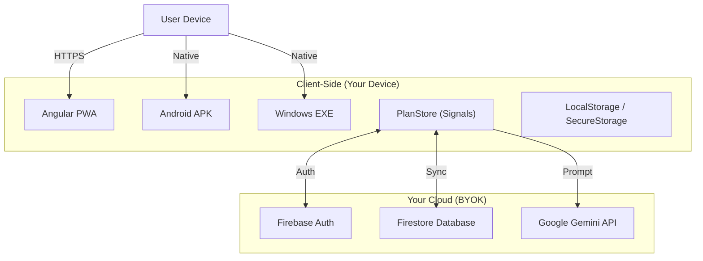

# Smart Planner Documentation
**Version:** 2.0.1  
**Last Updated:** January 2025

Welcome to the **Smart Planner** documentation package. This comprehensive guide covers everything you need to install, configure, build, and use Smart Planner across Web, Android, Windows, and Linux.

Smart Planner is a **Privacy-First, Self-Hosted** project management tool powered by Generative AI. You own your data, your keys, and your infrastructure.

---

## 📚 Documentation Overview

| Document | Description |
| :--- | :--- |
| **[User Setup Guide](SETUP_GUIDE.md)** | **Start Here.** Step-by-step guide to configuring your keys and cloud backend. |
| **[Advanced Build Guide](ADVANCED_BUILD_GUIDE.md)** | Instructions for building from source, CI/CD pipelines, and Native Android Auth. |
| **[Technical Documentation](PROJECT_DOCUMENTATION.md)** | Deep dive into architecture, data schema, security model, and code structure. |
| **[Release Notes](RELEASE_NOTES.md)** | Changelog, new features, and platform-specific updates. |

---

## 🚀 Quick Start (Web)

### Prerequisites
*   **Node.js** v18+
*   **npm** v9+
*   **Firebase Account** (Free Tier)
*   **Google AI Studio Account** (Free Tier)

### 5-Minute Setup

```bash
# 1. Clone the repository
git clone https://github.com/MuraliKrishna-git/smart-planner-app.git
cd smart-planner-app

# 2. Install dependencies
npm install

# 3. Start the development server
npm start
```

**4. Open in Browser:**
Navigate to `http://localhost:4200`.

**5. Configure:**
On first launch, you will see the **Setup Screen**. Follow the on-screen instructions or the [Setup Guide](SETUP_GUIDE.md) to enter your API keys.

---

## 📂 Folder Structure

```text
smart-planner-app/
├── README.md                  # This file
├── SETUP_GUIDE.md             # End-user configuration guide
├── ADVANCED_BUILD_GUIDE.md    # Developer build instructions
├── PROJECT_DOCUMENTATION.md   # Technical architecture doc
├── RELEASE_NOTES.md           # Version history
├── src/                       # Source code (Angular)
├── android/                   # Native Android project
├── electron/                  # Desktop wrapper logic
└── dist/                      # Compiled assets (after build)
```

---

## 🔧 System Requirements

### **For Running (End User)**
| Platform | Requirement |
| :--- | :--- |
| **Web** | Modern Browser (Chrome, Edge, Safari, Firefox) |
| **Android** | Android 8.0 (Oreo) or higher |
| **Windows** | Windows 10 or 11 (64-bit) |

### **For Building (Developer)**
| Component | Requirement |
| :--- | :--- |
| **OS** | Windows, macOS, or Linux |
| **RAM** | 8 GB+ recommended |
| **Tools** | Node.js 18+, Android Studio (for Mobile), VS Code |

---

## 🏗️ Architecture Overview



*   **Frontend:** Angular 18 + Bootstrap 5
*   **State:** Angular Signals
*   **Wrappers:** Capacitor 5 (Mobile), Electron (Desktop)
*   **Security:** Client-side encryption for API keys, PIN protection for settings.

---

## 🔗 Useful Links

*   **Firebase Console:** [console.firebase.google.com](https://console.firebase.google.com/)
*   **Google AI Studio:** [aistudio.google.com](https://aistudio.google.com/)
*   **Google Cloud Console:** [console.cloud.google.com](https://console.cloud.google.com/)

---

## 📞 Support & Feedback

**Community Support:**
*   **GitHub Issues:** Report bugs or request features.
*   **Discord:** [Join our Community](#) (Link in App Profile)

**Reporting Issues:**
When reporting issues, please include:
1.  Platform (Web, Android, or Desktop).
2.  Error message (if any).
3.  Steps to reproduce.

---

## 📄 License

Smart Planner is open-source software licensed under the **MIT License**. You are free to modify and distribute it, provided you keep the license file.

---

## 🔄 Version History

| Version | Date | Notes |
| :--- | :--- | :--- |
| **2.0.1** | Jan 2025 | **Major Release.** Added BYOK architecture, Desktop Loopback Auth, Native Android Auth, and Secure Storage. |
| **1.0.0** | Dec 2024 | Initial Beta Release. |

---

## ⚠️ Troubleshooting

**Android Google Sign-In Stuck Loading?**
If you are using the pre-built APK from Releases, Google Sign-In might hang because it lacks your specific SHA-1 fingerprint.
*   **Fix:** Close the app and reopen it. Use **Email/Password** login instead.
*   **Fix (Advanced):** Build the app from source using the [Advanced Build Guide](ADVANCED_BUILD_GUIDE.md) to enable native Google Sign-In.

---
© 2025 Smart Planner. Built with ❤️ by Developers for Developers.
